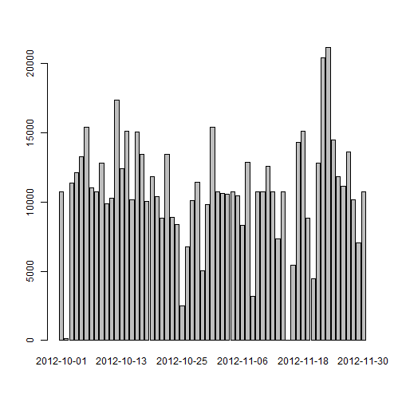

Programming Assignment 1 
========================================================

## Loading and Preprocessing the data:

* Load the data


```r
data <- read.csv("activity.csv")
```

* Transform class of 'date' column  from factor to Date


```r
data$date <- as.Date(data$date)
```

# What is mean total number of steps taken per day?

* Histogram of Total number of steps taken each day


```r
good <- complete.cases(data) #Ignore NA values
data2 <- data[good, ] #Store clean data set in data2
TotalSteps <- tapply(data2[,1], data2[,2], sum) #Total steps in each day
barplot(TotalSteps) #Histogram plotted
```

 

* Mean and Median total number of steps taken per day


```r
Mean <- mean(TotalSteps)
Median <- median(TotalSteps)
```

Mean is **1.0766 &times; 10<sup>4</sup>** and Median is **10765**

# What is the average daily activity pattern?

* Time Series plot of 5-min Interval and Average number of steps taken


```r
AverageSteps <- tapply(data2[,1], data2[,3], mean) #Average steps in each interval across all days
plot(as.numeric(names(AverageSteps)), AverageSteps, type="l", main = "Average steps per interval", 
     xlab="5-min Interval", ylab="Average number of Steps")
```

 

* Maximum number of Steps


```r
MaxSteps <- AverageSteps[AverageSteps == max(AverageSteps)]
```

**835** interval contains **206.1698** number of steps which is maximum.

# Input missing values

* Calculate and report the total number of missing values in the dataset


```r
good <- !complete.cases(data)
MissValues <- sum(good)
```

There are **2304** rows with NA in this dataset.

* Devise a strategy for filling in all of the missing values in the dataset

All the NA's in 'Steps' column of this dataset are replaced by the mean number of steps of their corresponding interval.


```r
for(i in 1:nrow(data)){
        if(is.na(data[i,1])){
                data[i,1] = AverageSteps[names(AverageSteps) == data[i,3]]
        }
}
```

* Create a new dataset with missing data filled in

First 6 rows are as shown:


```r
head(data)
```

```
##     steps       date interval
## 1 1.71698 2012-10-01        0
## 2 0.33962 2012-10-01        5
## 3 0.13208 2012-10-01       10
## 4 0.15094 2012-10-01       15
## 5 0.07547 2012-10-01       20
## 6 2.09434 2012-10-01       25
```

* Make a histogram and calculate mean and median of total number of steps taken each day


```r
NewTotalSteps <- tapply(data[,1], data[,2], sum) #Total steps in each day
barplot(NewTotalSteps) #Histogram plotted
```

 

```r
NewMean <- mean(NewTotalSteps)
NewMedian <- median(NewTotalSteps)
```

Mean is **1.0766 &times; 10<sup>4</sup>** and Median is **1.0766 &times; 10<sup>4</sup>**

From the above analysis, we observe that mean **does not change at all**, whereas median has changed slightly from **10765** to **1.0766 &times; 10<sup>4</sup>**

# Are there differences in activity patterns between weekdays and weekends?

* Create a new factor variable with two levels: "weekday", and "weekend"


```r
a <- ifelse(weekdays(data[,2]) == "Saturday" | weekdays(data[,2]) == "Sunday", "weekend", "weekday")
a <- factor(as.character(a))
data <- cbind(data, a)
colnames(data)[4] = "day"
```

* Time series plot of 5-minute interval and average number of steps taken on weekdays and weekends


```r
MeanDayType = aggregate(data$steps, by = list(data$interval, data$day), FUN = mean)
names(MeanDayType) = c("Interval", "DayType", "MeanSteps")
library(lattice)
```

```
## Warning: package 'lattice' was built under R version 3.0.3
```

```r
xyplot(MeanSteps ~ Interval | DayType, data = MeanDayType, layout = c(1,2), type="l", ylab="Number of Steps")
```

 
